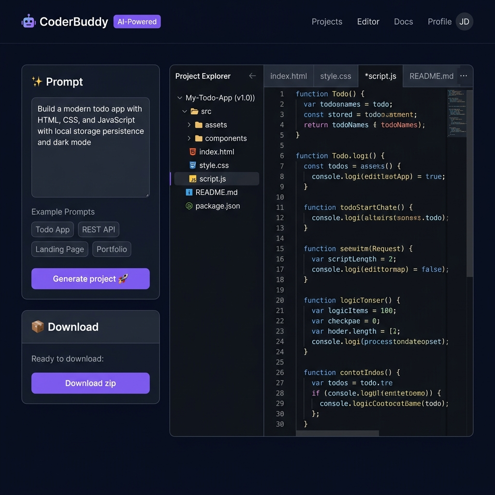
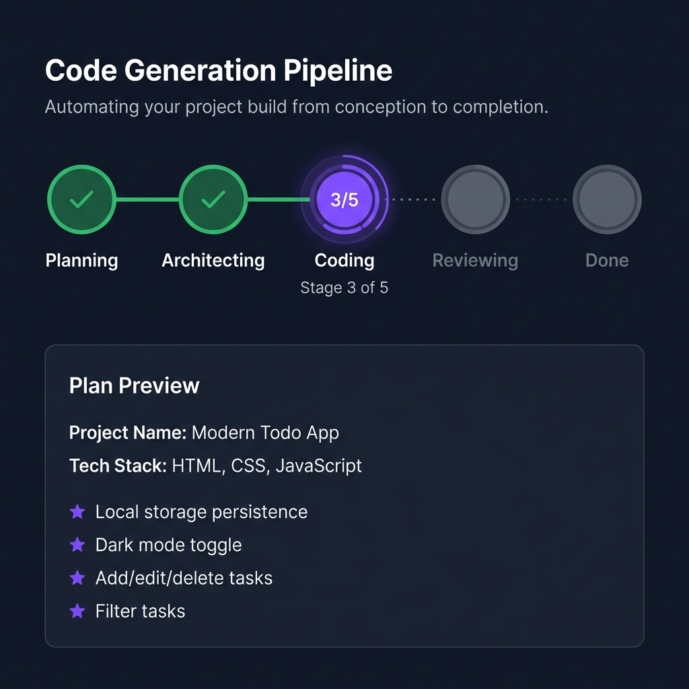
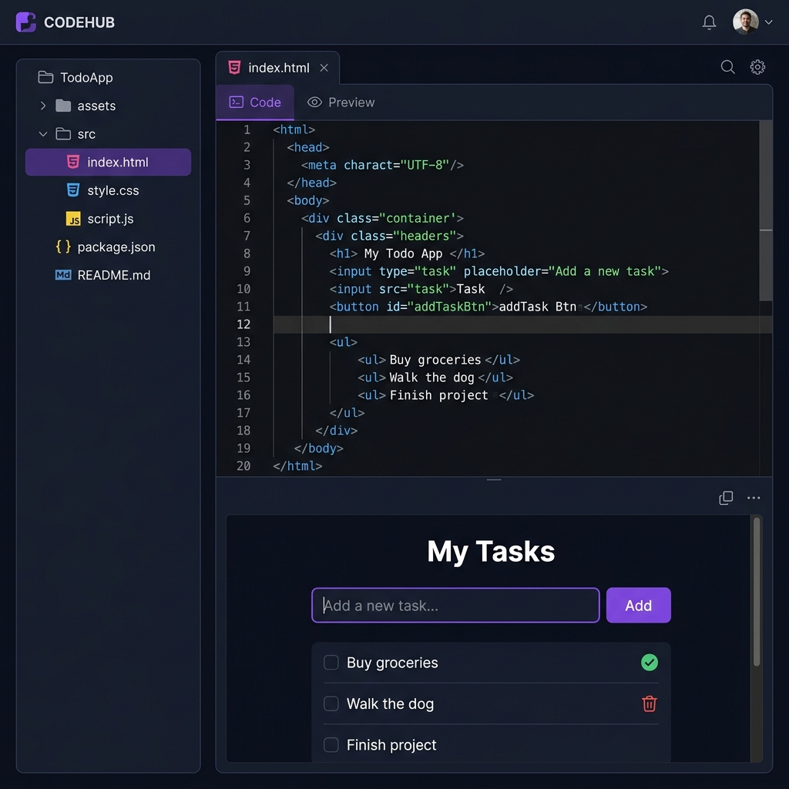
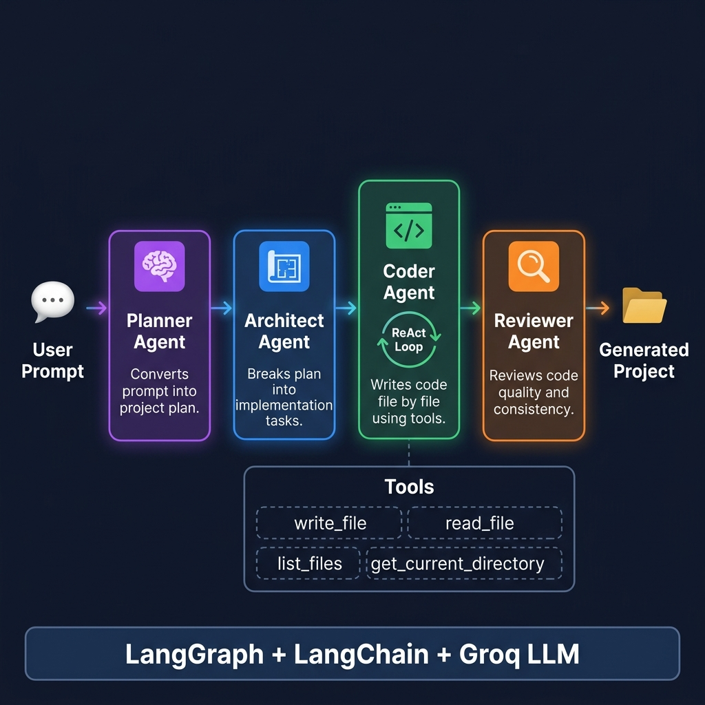
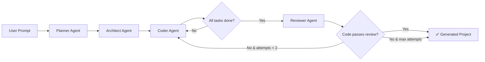

<p align="center">
  
</p>

<h1 align="center">🤖 CoderBuddy</h1>

<p align="center">
  <strong>AI-Powered Code Generator — Turn Ideas into Full Projects in Seconds</strong>
</p>

<p align="center">
  <a href="#features"></a>
  <a href="#tech-stack"></a>
  <a href="#license"></a>
  <a href="https://www.python.org/"></a>
  <a href="https://react.dev/"></a>
</p>

<p align="center">
  A multi-agent LLM pipeline that converts <strong>natural language descriptions</strong> into complete, ready-to-run project codebases — with a sleek web UI for real-time progress tracking, code browsing, live HTML preview, and one-click ZIP download.
</p>

---

## 📑 Table of Contents

- [✨ Features](#-features)
- [📸 Screenshots](#-screenshots)
- [🏗️ Architecture](#️-architecture)
- [🛠️ Tech Stack](#️-tech-stack)
- [🚀 Getting Started](#-getting-started)
  - [Prerequisites](#prerequisites)
  - [Backend Setup](#backend-setup)
  - [Frontend Setup](#frontend-setup)
  - [CLI Mode](#cli-mode)
  - [Docker](#docker)
- [⚙️ Configuration](#️-configuration)
- [📡 API Reference](#-api-reference)
- [📁 Project Structure](#-project-structure)
- [🧪 Running Tests](#-running-tests)
- [🔧 How It Works](#-how-it-works)
- [🛡️ Security](#️-security)
- [🤝 Contributing](#-contributing)
- [📄 License](#-license)

---

## ✨ Features

| Feature | Description |
|---|---|
| 🧠 **Multi-Agent Pipeline** | Four specialized AI agents (Planner → Architect → Coder → Reviewer) collaborate to generate production-quality code |
| ⚡ **Real-Time Progress** | Live pipeline visualization with Server-Sent Events (SSE) — watch planning, architecting, coding, and reviewing stages in real-time |
| 📝 **Plan Preview** | Instantly see the AI's project plan (name, tech stack, features, file list) before code generation begins |
| 💻 **Monaco Code Editor** | VS Code-grade syntax highlighting for 7+ languages with a read-only code browser |
| 👁️ **Live HTML Preview** | Toggle between code view and a sandboxed live preview for HTML files — CSS and JS are automatically inlined |
| 📦 **One-Click Download** | Download the entire generated project as a ZIP archive |
| 📜 **Prompt History** | Local storage-backed history of past prompts with quick re-use |
| 🔄 **Code Review Loop** | The Reviewer agent checks for syntax errors, missing imports, and cross-file consistency — and can send code back for fixes |

---

## 📸 Screenshots

### Main Interface
> The premium dark-themed dashboard where you enter your project idea, track generation progress, and browse generated files.

<p align="center">
  
</p>

### Real-Time Pipeline Progress
> Watch the AI agents work through each stage — Planning, Architecting, Coding (with file-level progress), and Reviewing — with a live plan preview card.

<p align="center">
  
</p>

### Code Viewer & Live Preview
> Browse generated files in a tree explorer, inspect code with Monaco Editor syntax highlighting, and toggle to a live sandboxed HTML preview.

<p align="center">
  
</p>

---

## 🏗️ Architecture

CoderBuddy uses a **multi-agent pipeline** built with [LangGraph](https://github.com/langchain-ai/langgraph), where each agent has a specialized role:

<p align="center">
  
</p>

```
User Prompt → [Planner] → [Architect] → [Coder (ReAct Loop)] → [Reviewer] → Generated Project
```

| Agent | Role | Input | Output |
|---|---|---|---|
| 🧠 **Planner** | Converts a natural language prompt into a structured project plan | User prompt (string) | `Plan` — name, description, tech stack, features, file list |
| 📐 **Architect** | Breaks the plan into ordered, self-contained implementation tasks | `Plan` object | `TaskPlan` — ordered list of `ImplementationTask` with file paths and detailed instructions |
| ⚡ **Coder** | Implements each task using a ReAct tool-calling loop with file I/O | `TaskPlan` + tools | Generated source files on disk |
| 🔍 **Reviewer** | Reviews all generated code for quality, missing imports, and cross-file consistency | Generated files + tools | `ReviewResult` — pass/fail verdict with issues and suggestions |

### Agent Pipeline Flow



### Key Design Decisions

- **Structured Output with Fallback**: Uses LLM structured output (tool-calling) first, then falls back to raw JSON parsing if the model returns prose — handles flaky LLM responses gracefully.
- **Error Recovery (IMP-05)**: If the Coder agent fails on a single step, it logs the error and moves to the next file instead of crashing the entire job.
- **Thread-Safe Job Isolation (BUG-02)**: Uses Python `contextvars` to isolate each job's file root — prevents race conditions when multiple users generate projects concurrently.
- **Token Tracking (IMP-06)**: A `TokenTracker` callback monitors cumulative LLM token usage per job for cost visibility.

---

## 🛠️ Tech Stack

### Backend
| Technology | Purpose |
|---|---|
| **Python 3.11+** | Runtime |
| **FastAPI** | REST API framework with async support |
| **LangGraph** | Multi-agent orchestration and state machine |
| **LangChain** | LLM abstraction layer and tool integration |
| **Groq** | LLM inference provider (default model: `openai/gpt-oss-120b`) |
| **Pydantic v2** | Data validation and state schemas |
| **Uvicorn** | ASGI production server |

### Frontend
| Technology | Purpose |
|---|---|
| **React 19** | UI framework |
| **TypeScript** | Type-safe JavaScript |
| **Vite 8** | Build tool and dev server with HMR |
| **Monaco Editor** | VS Code-grade code viewer with syntax highlighting |
| **Axios** | HTTP client for API communication |

### Infrastructure
| Technology | Purpose |
|---|---|
| **Docker** | Containerized deployment |
| **Render** | Cloud hosting with `build.sh` build script |
| **SSE (Server-Sent Events)** | Real-time status streaming |

---

## 🚀 Getting Started

### Prerequisites

- **Python 3.11+** — [Download](https://www.python.org/downloads/)
- **Node.js 18+** — [Download](https://nodejs.org/)
- **Groq API Key** — [Get one free](https://console.groq.com)

### Backend Setup

```bash
# 1. Clone the repository
git clone https://github.com/abhishek130904/AgentCoder.git
cd AgentCoder

# 2. Create and activate a virtual environment
python -m venv venv
# Windows
venv\Scripts\activate
# macOS/Linux
source venv/bin/activate

# 3. Install Python dependencies
pip install -r requirements.txt

# 4. Configure environment variables
cp .env.example .env
# Edit .env and add your GROQ_API_KEY
```

```bash
# 5. Start the API server
uvicorn backend.main:app --reload
```

The API server will be running at `http://127.0.0.1:8000`.

### Frontend Setup

```bash
# In a separate terminal
cd frontend
npm install
npm run dev
```

The frontend dev server starts at `http://localhost:5173` and automatically proxies `/api` requests to the backend at `http://127.0.0.1:8000`.

> **💡 Tip:** Open `http://localhost:5173` in your browser to start using CoderBuddy!

### CLI Mode

You can also use CoderBuddy from the command line without the web UI:

```bash
python main.py
# Enter your project prompt when asked
```

**Advanced CLI options:**

```bash
# Set a custom recursion limit (default: 100)
python main.py --recursion-limit 150
```

Generated files are saved to `generated_project/`.

### Docker

```bash
# Build the Docker image
docker build -t coderbuddy .

# Run with your API key
docker run -p 8000:8000 --env-file .env coderbuddy
```

The full app (API + frontend) will be available at `http://localhost:8000`.

### Deploying to Render

CoderBuddy includes a production-ready `build.sh` script for [Render](https://render.com):

1. Connect your GitHub repo on Render
2. Set **Build Command** to `./build.sh`
3. Set **Start Command** to `uvicorn backend.main:app --host 0.0.0.0 --port $PORT`
4. Add `GROQ_API_KEY` as an environment variable
5. Optionally set `CORS_ORIGINS` to your frontend domain

---

## ⚙️ Configuration

All configuration is done via environment variables (`.env` file):

| Variable | Default | Description |
|---|---|---|
| `GROQ_API_KEY` | *(required)* | Your Groq API key for LLM inference |
| `GROQ_MODEL` | `openai/gpt-oss-120b` | LLM model identifier |
| `AGENT_DEBUG` | `false` | Enable LangChain verbose/debug logging (`true`, `1`, `yes`, or `on`) |
| `CORS_ORIGINS` | `*` | Comma-separated list of allowed CORS origins |
| `VITE_API_URL` | `/api` | Frontend API base URL (set for production builds) |

**Example `.env` file:**

```env
GROQ_API_KEY=gsk_xxxxxxxxxxxxxxxxxxxx
GROQ_MODEL=openai/gpt-oss-120b
AGENT_DEBUG=false
CORS_ORIGINS=https://myapp.com,https://staging.myapp.com
```

---

## 📡 API Reference

### Base URL

- **Development:** `http://localhost:8000/api`
- **Production:** `https://your-domain.com/api`

### Endpoints

| Method | Endpoint | Description |
|---|---|---|
| `POST` | `/api/projects` | Create a new project generation job |
| `GET` | `/api/projects/{job_id}/status` | Get job status and pipeline stage |
| `GET` | `/api/projects/{job_id}/stream` | SSE stream of real-time status updates |
| `GET` | `/api/projects/{job_id}/files` | List all generated files |
| `GET` | `/api/projects/{job_id}/files/{path}` | Get content of a specific file |
| `GET` | `/api/projects/{job_id}/download` | Download project as ZIP archive |
| `GET` | `/health` | Health check endpoint |

### Create a Project

**Request:**

```bash
curl -X POST http://localhost:8000/api/projects \
  -H "Content-Type: application/json" \
  -d '{"prompt": "Build a modern todo app with HTML, CSS, and JS"}'
```

**Response:**

```json
{
  "job_id": "550e8400-e29b-41d4-a716-446655440000",
  "status": "started"
}
```

### Check Job Status

**Request:**

```bash
curl http://localhost:8000/api/projects/{job_id}/status
```

**Response:**

```json
{
  "status": "running",
  "prompt": "Build a modern todo app with HTML, CSS, and JS",
  "stage": "coding",
  "coding_step": 3,
  "coding_total": 5,
  "plan": {
    "name": "Modern Todo App",
    "description": "A feature-rich todo application",
    "techstack": "HTML, CSS, JavaScript",
    "features": ["Add/edit/delete tasks", "Local storage", "Dark mode"],
    "files": [...]
  },
  "started_at": 1716700000.0,
  "completed_at": null
}
```

### Pipeline Stages

The `stage` field in the status response cycles through:

| Stage | Description |
|---|---|
| `pending` | Job created, waiting to start |
| `planning` | Planner agent is generating the project plan |
| `planning_done` | Plan is ready (includes `plan` field in response) |
| `architecting` | Architect agent is breaking plan into tasks |
| `architecting_done` | Tasks are ready |
| `coding` | Coder agent is implementing files (check `coding_step`/`coding_total`) |
| `reviewing` | Reviewer agent is checking code quality |
| `done` | Project generation complete |
| `failed` | An error occurred (check `error` field) |

---

## 📁 Project Structure

```
AgentCoder/
├── agent/                      # 🧠 Multi-agent pipeline core
│   ├── __init__.py
│   ├── graph.py                # LangGraph state machine — Planner → Architect → Coder → Reviewer
│   ├── prompts.py              # System prompts for each agent with guardrails
│   ├── states.py               # Pydantic models: Plan, TaskPlan, CoderState, ReviewResult
│   └── tools.py                # Sandboxed file I/O tools (write_file, read_file, list_files)
│
├── backend/                    # 🌐 FastAPI REST API server
│   ├── __init__.py
│   ├── main.py                 # App factory, CORS, SSE streaming, SPA serving
│   ├── routes.py               # REST endpoints for project CRUD and download
│   └── jobs.py                 # Job persistence (JSON file store) and agent execution
│
├── frontend/                   # ⚛️ React + TypeScript + Vite
│   ├── src/
│   │   ├── api/
│   │   │   └── api.ts          # Axios-based API client
│   │   ├── components/
│   │   │   ├── CodeViewer.tsx   # Monaco Editor + live HTML preview
│   │   │   ├── FileExp.tsx     # Hierarchical file tree explorer
│   │   │   ├── GenerationStats.tsx # Post-generation stats (time, file count)
│   │   │   ├── HistoryDropdown.tsx # Prompt history with localStorage
│   │   │   ├── PlanPreview.tsx # Live plan preview card
│   │   │   ├── ProgressPipeline.tsx # Visual pipeline stage tracker
│   │   │   ├── PromptBox.tsx   # Prompt textarea with example chips
│   │   │   └── Toast.tsx       # Toast notification system
│   │   ├── App.tsx             # Main app component with state management
│   │   ├── App.css             # 780+ lines of premium dark theme styles
│   │   ├── index.css           # Global design tokens and utilities
│   │   └── main.tsx            # React entry point
│   ├── index.html              # HTML template
│   ├── package.json            # Dependencies (React 19, Monaco, Axios, Vite 8)
│   ├── vite.config.ts          # Vite config with API proxy
│   └── tsconfig.json           # TypeScript configuration
│
├── tests/                      # 🧪 Unit tests
│   ├── __init__.py
│   └── test_agent.py           # Path traversal, model validation, job store tests
│
├── docs/                       # 📸 Documentation assets
│   └── screenshots/            # README screenshots
│
├── generated_project/          # 📂 Output directory for generated codebases
├── main.py                     # 🖥️ CLI entry point
├── build.sh                    # 🚀 Render deployment build script
├── Dockerfile                  # 🐳 Production container
├── pyproject.toml              # Python project metadata and dependencies
├── requirements.txt            # Pip dependencies
├── .env.example                # Environment variable template
└── .gitignore                  # Git ignore rules
```

---

## 🧪 Running Tests

```bash
# Run all tests with verbose output
python -m pytest tests/ -v

# Run a specific test class
python -m pytest tests/test_agent.py::TestSafePathForProject -v

# Run with coverage (if pytest-cov is installed)
python -m pytest tests/ -v --cov=agent --cov=backend
```

### Test Coverage

| Module | Tests | What's Covered |
|---|---|---|
| `agent/tools.py` | 7 tests | Path traversal prevention, `contextvars` job isolation, safe path resolution |
| `agent/states.py` | 5 tests | Pydantic model validation for `Plan`, `TaskPlan`, `ReviewResult` |
| `backend/routes.py` | 3 tests | Input validation (prompt length min/max) |

---

## 🔧 How It Works

Here's what happens when you click **"Generate project"**:

1. **User submits a prompt** → The frontend sends a `POST /api/projects` request
2. **Job creation** → The backend creates a job entry in `jobs_store.json` and starts the agent pipeline as a background task
3. **🧠 Planner Agent** → Receives the natural language prompt and produces a structured `Plan` (project name, tech stack, features, file list)
4. **📐 Architect Agent** → Takes the `Plan` and breaks it into an ordered list of `ImplementationTask`s, each with a specific file path and detailed coding instructions
5. **⚡ Coder Agent (ReAct loop)** → Iterates through each task, reads existing files for context, and uses `write_file` to generate code. If a step fails, it logs the error and continues to the next file
6. **🔍 Reviewer Agent** → Reads all generated files and checks for syntax errors, missing imports, and cross-file consistency. Returns a pass/fail `ReviewResult`
7. **Review loop** → If the review fails and we haven't hit the max attempts (2), the Coder reruns to fix the issues
8. **Frontend polls** → The React app polls `/api/projects/{id}/status` every 2 seconds, updating the pipeline visualization and status messages in real-time
9. **Project ready** → Once complete, all file contents are fetched and displayed in the Monaco code editor with syntax highlighting

---

## 🛡️ Security

CoderBuddy implements several security measures:

- **Path Traversal Prevention (BUG-03)**: All file operations go through `safe_path_for_project()` which resolves paths and verifies they stay within the project sandbox. Attempts to access `../../etc/passwd` or similar are rejected with a `ValueError`.
- **No Shell Execution (BUG-04)**: The `run_cmd` tool was deliberately removed to eliminate shell injection risks. The coder agent can only read and write files.
- **Input Validation (BUG-14)**: Prompts are validated with Pydantic — minimum 10 characters, maximum 2,000 characters — preventing excessively large prompts from burning API tokens.
- **Sandboxed Previews**: Live HTML previews run in an `<iframe>` with `sandbox="allow-scripts"` — no access to the parent page, cookies, or navigation.
- **CORS Configuration**: CORS origins are configurable via environment variable. Defaults to `*` for development but should be restricted in production.

---

## 🤝 Contributing

Contributions are welcome! Here's how to get started:

1. **Fork** the repository
2. **Create** a feature branch: `git checkout -b feature/amazing-feature`
3. **Commit** your changes: `git commit -m "Add amazing feature"`
4. **Push** to the branch: `git push origin feature/amazing-feature`
5. **Open** a Pull Request

### Development Guidelines

- Follow existing code style and naming conventions
- Add tests for new features (especially security-sensitive code)
- Update this README if you add new features or change the API
- Use conventional commit messages

### Ideas for Contributions

- [ ] Support for additional LLM providers (OpenAI, Anthropic, Ollama)
- [ ] SQLite/PostgreSQL job persistence (replacing JSON file store)
- [ ] WebSocket-based real-time streaming (replacing polling)
- [ ] Project templates and starter kits
- [ ] Syntax error auto-fix via the Reviewer loop
- [ ] Multi-file diff view in the code viewer
- [ ] User authentication and project history

---

## 📄 License

This project is licensed under the **MIT License** — see the [LICENSE](LICENSE) file for details.

---

<p align="center">
  <strong>Built with ❤️ using LangGraph, FastAPI, and React</strong>
  <br />
  <sub>⭐ Star this repo if you find it useful!</sub>
</p>
